# BasketballPlayerSystem-Based-on-QT
A system for the data of basketball players, including name, teams' name, three-pointer num, rebound num, dunk num, score and date of each match.
  系统打开后，单击打开文件，会依次跳出两个文件选择窗口  

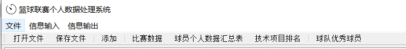  

第一个选择比赛信息文件，第二个选择球员信息文件  
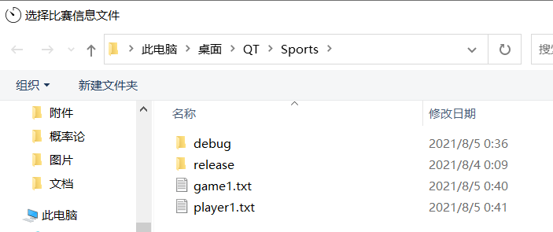 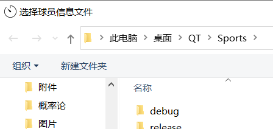 

 成功导入已有球员和比赛信息

  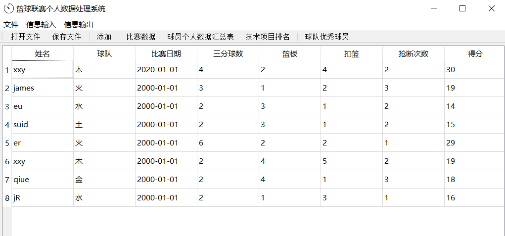  
  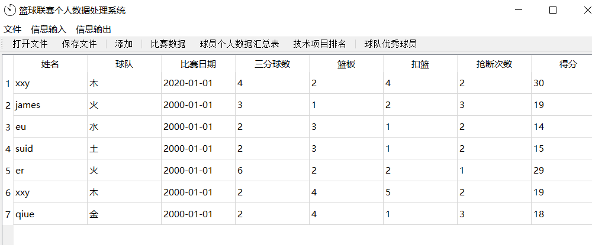  
  选择“添加”，可新增球员比赛数据  
  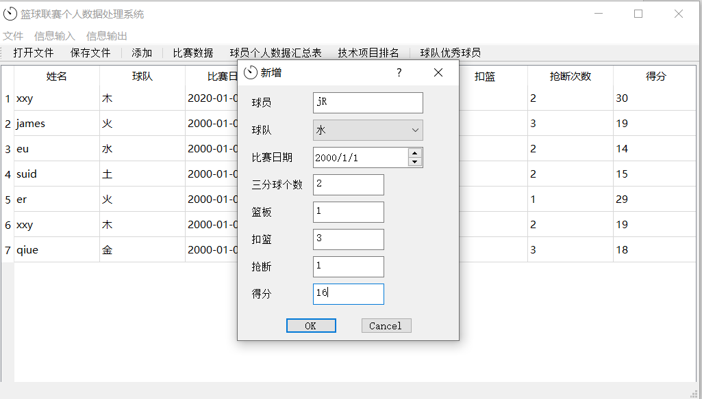  
  添加后数据：    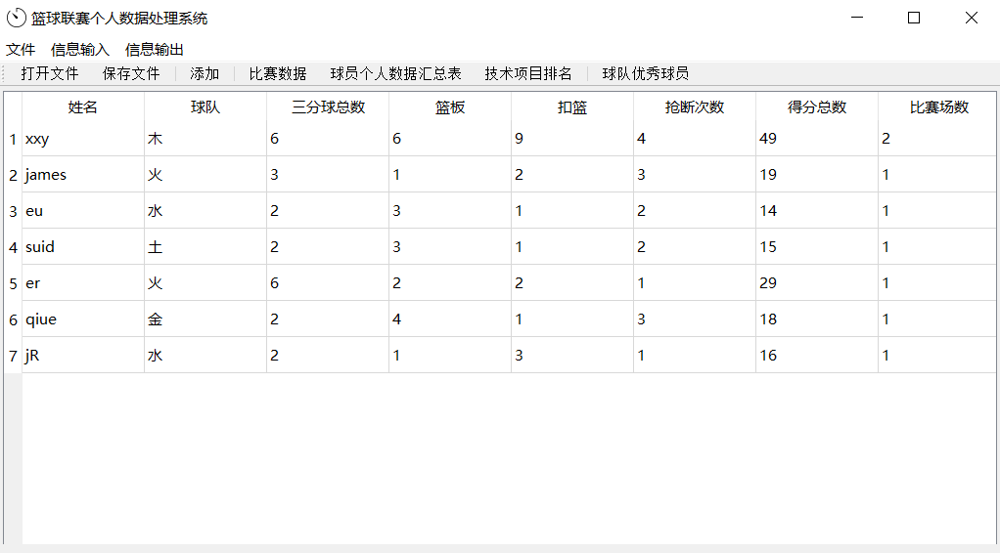  
  单击“技术项目排名”，筛选单项前三球员  
  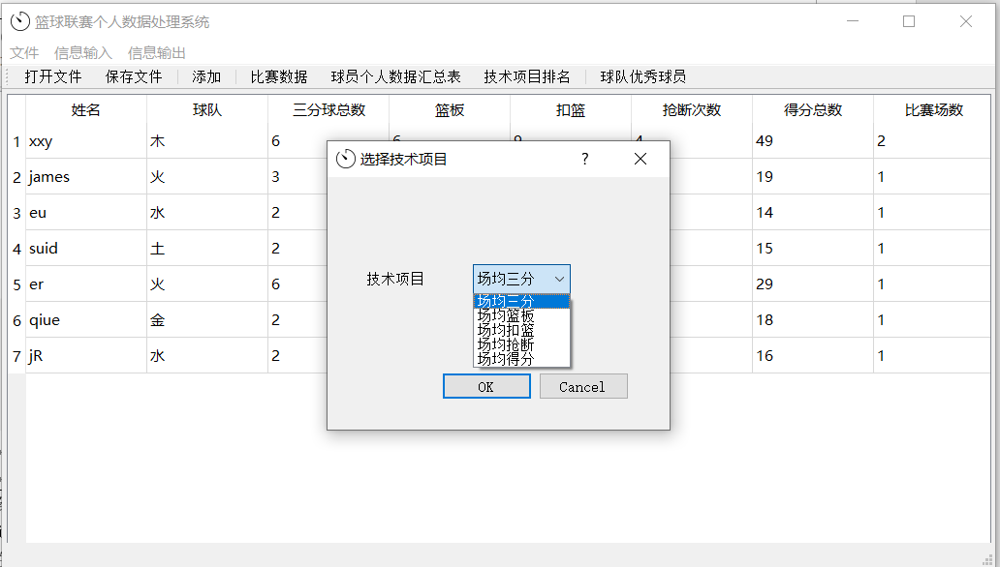  
  场均三分前三球员  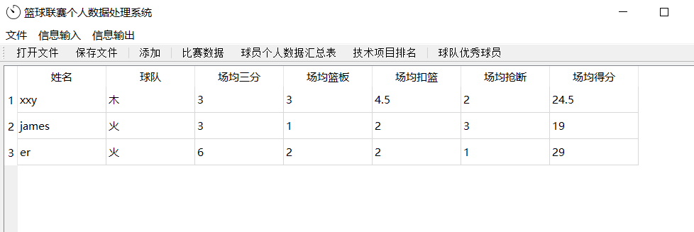  
  场均抢断前三球员  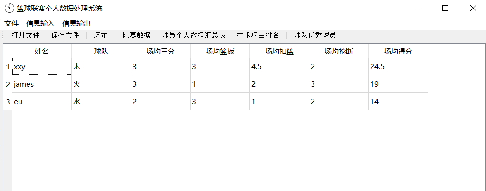  
  筛选球队优秀球员  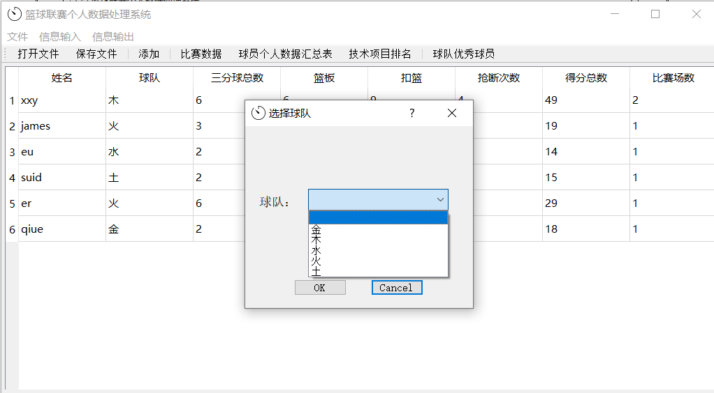  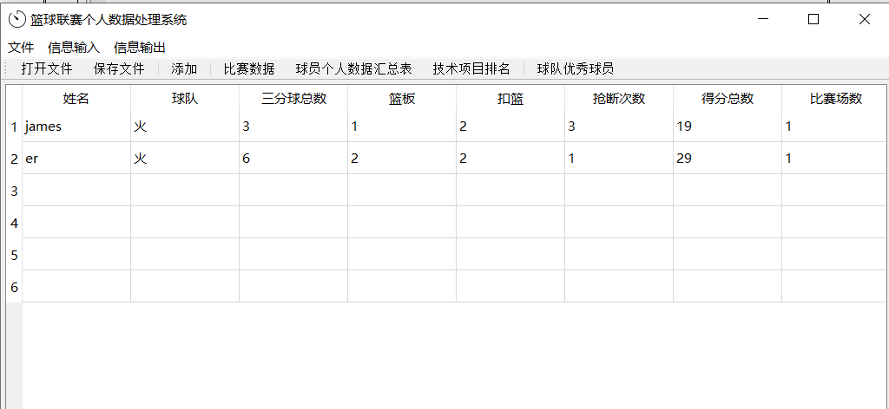  

